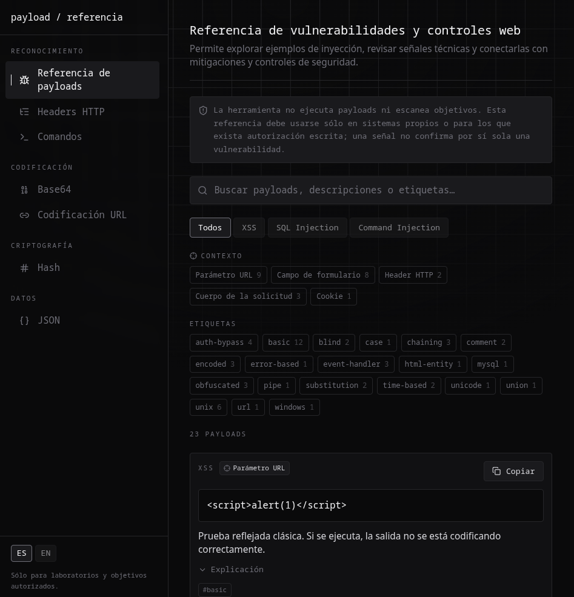

# Web Vulnerability Control Mapping

**Español** | [English](README.en.md)

## Qué es

WVCM es una referencia educativa que conecta ejemplos básicos de Cross-Site
Scripting (XSS), SQL Injection y Command Injection con señales técnicas,
mitigaciones y relaciones con controles de seguridad. Está pensada para
estudiantes, analistas y personas que preparan una evaluación autorizada.

## Demo

[Abrir la demo](https://wvcm.sggaray.com)



## Qué podés hacer

- Explorar payloads estáticos y filtrarlos por categoría, contexto o etiqueta.
- Revisar qué condiciones necesita cada ejemplo y qué señal podría producir.
- Analizar texto de respuestas HTTP y observar un conjunto acotado de headers
  de seguridad.
- Codificar y decodificar Base64, URLs y JSON con controles de fidelidad de
  datos.
- Calcular hashes MD5, SHA-1 y SHA-256.
- Armar comandos nmap y curl para copiar y ejecutar en tu propio laboratorio.
- Consultar mappings conceptuales con OWASP Top 10, NIST SP 800-53 e ISO/IEC
  27001.

## Herramientas incluidas

Payload Reference, Analizador de headers HTTP, Hash, Base64, URL, JSON y
Commands. La interfaz está disponible en español e inglés; el
selector ES/EN guarda la preferencia en el navegador.

## Cómo interpreta la evidencia

Los estados del Analizador de headers HTTP describen únicamente lo observado
en la respuesta pegada. Que un header esté presente no significa que la
protección sea efectiva, y que no se observe no confirma una vulnerabilidad.

Un mapping indica una relación relevante, pero no demuestra que el control
esté implementado, sea efectivo ni determina compliance. Las señales deben
compararse, repetirse y corroborarse dentro del contexto técnico real.

## Qué no demuestra

WVCM:

- no ejecuta payloads;
- no escanea objetivos;
- no confirma vulnerabilidades ni explotación;
- no determina la efectividad de controles;
- no determina compliance;
- usa mappings como apoyo contextual, no como evidencia de implementación.

## Flujo de datos

Payload Reference, Analizador de headers HTTP, Base64, URL, JSON y la generación
de comandos funcionan localmente en el navegador. Hash envía el texto y los
algoritmos elegidos a `POST /api/hash`; la entrada está acotada y la aplicación
no la almacena.

## Desarrollo local

Requiere Node.js 22.

```sh
npm ci
npm run dev
```

Abrí `http://localhost:3000`.

## Validación

```sh
npm run lint
npm run typecheck
npm test
npm run build
```

La suite automatizada cubre parsing, límites de API, serialización de comandos,
mappings, fidelidad de datos, navegación e interacción accesible. El build de
Next.js puede ejecutarse en un hosting compatible con Node.js 22 o en Vercel.

## Cloudflare Workers

WVCM se despliega en Cloudflare Workers con el adapter
[OpenNext](https://opennext.js.org/cloudflare). La configuración está en
`wrangler.jsonc` y `open-next.config.ts`.

```sh
npm run preview
```

Compila la app para Workers y la sirve localmente con el runtime de Cloudflare
en `http://localhost:8787`.

Para desplegar desde Cloudflare Workers Builds:

- Build command: `npx opennextjs-cloudflare build`
- Deploy command: `npx opennextjs-cloudflare deploy`

`public/_headers` replica en los assets estáticos los headers de seguridad de
`next.config.mjs`; si cambiás unos, actualizá los otros.

## Uso autorizado

Usá WVCM sólo en sistemas propios o para los que tengas autorización escrita.
El proyecto es una ayuda educativa y no reemplaza una evaluación profesional.

## Licencia

MIT
